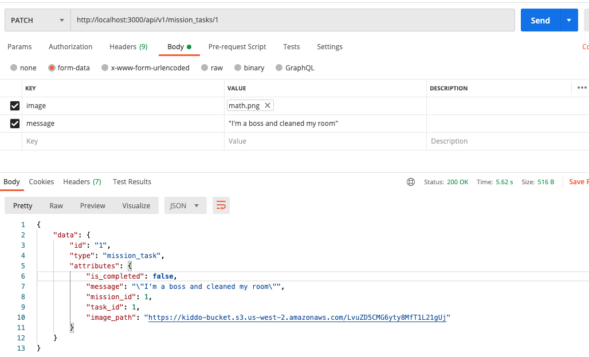

# README
# kiddo-backend

## Table of Contents:

- [Overview](#overview)
- [Techstack](#techstack)
- [API Contracts](#api-contracts)
- [Schema](#schema)
- [Contributors](#contributors)

## Overview


## Techstack

- Ruby on Rails
- Simplecov
- RSpec
- PostgresQL

## For Local Setup
- clone this repo locally
- install ruby and rails
- install the latest packages:
`$bundle`
- Install the 'Figaro' gem (which will create an application.yml file and will add it to your .gitignore file).
`$bundle exec figaro install`<br>
- you then neeed to add the below environmental variables to your application.yml file:<br>
`S3_ACCESS_KEY_ID: <get key from BE teammate>`<br>
`S3_SECRET_ACCESS_KEY: <get key from BE teammate>`<br>
- then run following commands from your terminal:
`$bundle #to install necessary ruby gems (packages)`<br>
`$bundle exec rspec #to run test suite`<br>
`$rails s #to run server`<br>


## API Contracts

#### MissionTasks
Note, MissionTasks use AWS S3 file storage.  For this to work properly on local host you'll need to install the Figaro gem and then add the AWS keys from your teammates.  See the setup section for more detail.  

##### Get A Mission's Tasks ('GET /api/v1/mission/:id/tasks)
##### Successful Response
```
{
    "data": [
        {
            "id": 1,
            "type": "mission_task",
            "attributes": {
                "points": 100,
                "mission_id": 1,
                "task_id": 1,
                "task_name": "EQ level up",
                "task_description": "Say something kind",
                "task_category": "EQ",
                "message": "\"I'm a boss and cleaned my room\"",
                "image_path": "https://kiddo-bucket.s3.us-west-2.amazonaws.com/JRwCyNM9bWaZqkj4egVYFtXA
                "is_completed": false
            }
        },
        {
            "id": 2,
            "type": "mission_task",
            "attributes": {
                "points": 50,
                "mission_id": 1,
                "task_id": 2,
                "task_name": "IQ level up",
                "task_description": "Conquer homework",
                "task_category": "IQ",
                "message": "Nailed it!",
                "image_path": "",
                "is_completed": true
            }
        }
    ]
}
```

##### Create ('POST /api/v1/mission_tasks)
###### Request 
Headers: { 'CONTENT_TYPE' : 'application/json' }
Body: {mission_id: 1, task_id: 2}
##### Successful Response
```
{
    "data": {
        "id": "5",
        "type": "mission_task",
        "attributes": {
            "is_completed": false,
            "message": null,
            "mission_id": 1,
            "task_id": 1,
            "image_path": null
        }
    }
}
```
##### Unsuccesful Response
```
{
    "data": {
        "errors": "Task must exist",
        "status": "bad_request"
    }
}
```

##### Update ('PUT /api/v1/mission_tasks/:id)
###### Request 
Headers: { 'CONTENT_TYPE' : 'multipart/form-data' }
Body: { "is_completed" : "true", "message": "Im done!!", "image": "image_file"}
##### Successful Response

```
{
    "data": {
        "id": "1",
        "type": "mission_task",
        "attributes": {
            "is_completed": true,
            "message": "\"Im done!!"\",
            "mission_id": 1,
            "task_id": 1,
            "image_path": "https://kiddo-bucket.s3.us-west-2.amazonaws.com/JRwCyNM9bWaZqkj4egVYFtXA
        }
    }
}
```
##### Unsuccesful Response
```
{
    "data": {
        "errors": "mission task does not exist.",
        "status": "bad_request"
    }
}
```


#### Users
##### Index (`GET /api/vi/users`)
###### Successful Response
```
{
    "data": [
        {
            "id": "1",
            "type": "user",
            "attributes": {
                "name": "Calvin",
                "email": "Calvin@example.com"
            }
        },
        {
            "id": "2",
            "type": "user",
            "attributes": {
                "name": "Hobbes",
                "email": "Hobbes@example.com"
            }
        }
    ]
}
```

##### Show (`GET /api/vi/users/1`)
###### Successful Response
```
{
    "data": {
        "id": "1",
        "type": "user",
        "attributes": {
            "name": "Calvin",
            "email": "Calvin@example.com"
        }
    }
}
```

##### Create (`POST /api/vi/users`)
###### Request Structure

```
headers: 'CONTENT_TYPE' => 'application/json'
body: {"name": "John", "email": "John@example.com"}
```
###### Successful Response
```
{
    "data": {
        "id": "3",
        "type": "user",
        "attributes": {
            "name": "John",
            "email": "John@example.com"
        }
    }
}
```

##### DESTROY (`DELETE /api/vi/users/1`)

###### Successful Response
```
204 Response No Content
```

#### Missions
##### Create (`POST /api/v1/missions`)

###### Request Structure
```
headers: 'CONTENT_TYPE' => 'application/json'
body: {"name": "Weekly chores", "due_date": "2001-02-03", "user_id"=>515}
```

###### Successful Response
```
{ 'data' => { 'id' => '304',
              'type' => 'mission',
              'attributes' => { 'name' => 'Weekly chores',
                                'due_date' => '2001-02-03',
                                'user_id' => 487,
                                'created_at' => '2021-02-21T04:05:24.749Z',
                                'updated_at' => '2021-02-21T04:05:24.749Z' } } }
```
###### Unsuccessful Response
```
{"data"=>{"errors"=>"Name can't be blank", "status"=>"bad_request"}}
```
##### Index (`GET /api/v1/missions`)

###### Successful Response
```
{ 'data' =>
  [{ 'id' => '320',
     'type' => 'mission',
     'attributes' => { 'name' => 'Weekly otter chores',
                       'due_date' => '2021-02-26', 
                       'user_id' => 513,
                       'created_at' => '2021-02-21T00:00:00.000Z',
                       'updated_at' => '2021-02-21T00:00:00.000Z' } },
   { 'id' => '321',
     'type' => 'mission',
     'attributes' => { 'name' => 'Weekly grasshopper chores',
                       'due_date' => '2021-02-26',
                       'user_id' => 514,
                       'created_at' => '2021-02-21T00:00:00.000Z',
                       'updated_at' => '2021-02-21T00:00:00.000Z' } }] }
```
#### Tasks
##### Create (`POST /api/v1/tasks`)

###### Request Structure
```
headers: 'CONTENT_TYPE' => 'application/json'
body: {"name":"test", "description":"testing", "category":"test", "points":3}
```

###### Successful Response
```
{
    "data": {
        "id": "4",
        "type": "task",
        "attributes": {
            "name": "test",
            "description": "testing",
            "category": "test",
            "points": 3
        }
    }
}
```
###### Unsuccessful Response
```
{
    "data": {
        "errors": "Name can't be blank",
        "status": 400
    }
}
```
##### Index (`GET /api/v1/tasks`)

###### Successful Response
```
{
    "data": [
        {
            "id": "1",
            "type": "task",
            "attributes": {
                "name": "EQ level up",
                "description": "Say something kind",
                "category": "EQ",
                "points": 100
            }
        },
        {
            "id": "2",
            "type": "task",
            "attributes": {
                "name": "IQ level up",
                "description": "Conquer homework",
                "category": "IQ",
                "points": 50
            }
        },
        {
            "id": "3",
            "type": "task",
            "attributes": {
                "name": "Special",
                "description": "Make your bed",
                "category": "Misc",
                "points": 1337
            }
        },
        {
            "id": "4",
            "type": "task",
            "attributes": {
                "name": "test",
                "description": "testing",
                "category": "test",
                "points": 3
            }
        }
    ]
}
```

## Schema


## Contributors

- Lola Dolinsky - [![LinkedIn][linkedin-shield]]() - [![GitHub][github-shield]](https://github.com/lo-la-do-li)

- Bailey Dunning - [![LinkedIn][linkedin-shield]](https://www.linkedin.com/in/baileydunning/) - [![GitHub][github-shield]](https://github.com/baileydunning)

- Scott Brabson - [![LinkedIn][linkedin-shield]](https://www.linkedin.com/in/scott-brabson/) - [![GitHub][github-shield]](https://github.com/brabbuss)

- Will Dunlap - [![LinkedIn][linkedin-shield]]() - [![GitHub][github-shield]](https://github.com/dunlapww)

- Brett Sherman - [![LinkedIn][linkedin-shield]](https://www.linkedin.com/in/brettshermanll/) - [![GitHub][github-shield]](https://github.com/BJSherman80)

- Shaun James - [![LinkedIn][linkedin-shield]](https://www.linkedin.com/in/shaun-james-2707a61bb/) - [![GitHub][github-shield]](https://github.com/ShaunDaneJames)

- Connor Ferguson - [![LinkedIn][linkedin-shield]](https://www.linkedin.com/in/connor-p-ferguson/) - [![GitHub][github-shield]](https://github.com/cpfergus1)


<!-- MARKDOWN LINKS & IMAGES -->
[linkedin-shield]: https://img.shields.io/badge/-LinkedIn-black.svg?style=flat-square&logo=linkedin&colorB=555
[github-shield]: https://img.shields.io/badge/-GitHub-black.svg?style=flat-square&logo=github&colorB=555
