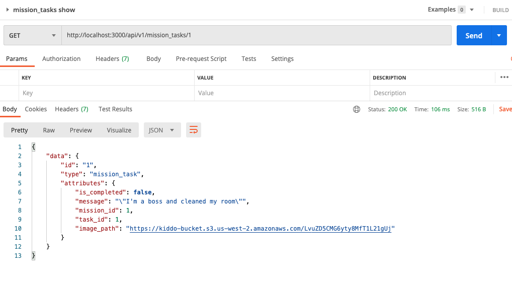

# README
# kiddo-backend

## Table of Contents:

- [Overview](#overview)
- [Techstack](#techstack)
- [API Contracts](#api-contracts)
- [Schema](#schema)
- [Contributors](#contributors)

## Overview of Application
This is the backend API for the kiddo application.  The FE application and a description of the application as a whole can be found [here](https://github.com/kiddo-capstone/kiddo-frontend). 

This Backend repository performs CRUD operations for users, missions, tasks, and mission_tasks, as requested by front end.  This application uses AWS S3 for cloud storage of images and action_mailer to send automated registration emails to new users.  This application uses Circle for continuous integration and is deployed on Heroku.  


## Techstack

- Ruby on Rails
- Simplecov
- RSpec
- PostgresQL

## For Local Setup
- clone this repo locally
- install ruby and rails
- install the latest packages:
`$bundle`
- Install the 'Figaro' gem (which will create an application.yml file and will add it to your .gitignore file).
`$bundle exec figaro install`<br>
- you then neeed to add the below environmental variables to your application.yml file:<br>
`S3_ACCESS_KEY_ID: <get key from BE teammate>`<br>
`S3_SECRET_ACCESS_KEY: <get key from BE teammate>`<br>
- then run following commands from your terminal:
`$bundle #to install necessary ruby gems (packages)`<br>
`$bundle exec rspec #to run test suite`<br>
`$rails s #to run server`<br>

## Database Schema
To avoid confusion, below does not include the tables created as part of active_storage.  below are the tables and fields that front end should be able to access:
```
create_table "active_storage_attachments", force: :cascade do |t|
    t.string "name", null: false
    t.string "record_type", null: false
    t.bigint "record_id", null: false
    t.bigint "blob_id", null: false
    t.datetime "created_at", null: false
    t.index ["blob_id"], name: "index_active_storage_attachments_on_blob_id"
    t.index ["record_type", "record_id", "name", "blob_id"], name: "index_active_storage_attachments_uniqueness", unique: true
  end

  create_table "active_storage_blobs", force: :cascade do |t|
    t.string "key", null: false
    t.string "filename", null: false
    t.string "content_type"
    t.text "metadata"
    t.bigint "byte_size", null: false
    t.string "checksum", null: false
    t.datetime "created_at", null: false
    t.index ["key"], name: "index_active_storage_blobs_on_key", unique: true
  end

  create_table "mission_tasks", force: :cascade do |t|
    t.bigint "mission_id"
    t.bigint "task_id"
    t.string "message"
    t.string "image_path"
    t.boolean "is_completed"
    t.datetime "created_at", null: false
    t.datetime "updated_at", null: false
    t.index ["mission_id"], name: "index_mission_tasks_on_mission_id"
    t.index ["task_id"], name: "index_mission_tasks_on_task_id"
  end

  create_table "missions", force: :cascade do |t|
    t.string "name"
    t.date "due_date"
    t.bigint "user_id"
    t.datetime "created_at", null: false
    t.datetime "updated_at", null: false
    t.index ["user_id"], name: "index_missions_on_user_id"
  end

  create_table "parents", force: :cascade do |t|
    t.string "name"
    t.string "email"
    t.datetime "created_at", null: false
    t.datetime "updated_at", null: false
  end

  create_table "tasks", force: :cascade do |t|
    t.string "name"
    t.string "description"
    t.string "category"
    t.integer "points"
    t.datetime "created_at", null: false
    t.datetime "updated_at", null: false
    t.boolean "photo"
    t.string "resource_link"
    t.string "resource_alt"
    t.string "resource_type"
  end

  create_table "users", force: :cascade do |t|
    t.string "name"
    t.datetime "created_at", null: false
    t.datetime "updated_at", null: false
    t.integer "points"
    t.bigint "parent_id"
    t.index ["parent_id"], name: "index_users_on_parent_id"
  end
  
  ```


## API Contracts

#### MissionTasks
Note, MissionTasks use AWS S3 file storage.  For this to work properly on local host you'll need to install the Figaro gem and then add the AWS keys from your teammates.  See the setup section for more detail.  

##### MissionTask Show ('Get /api/v1/mission_tasks/:id)
##### Request/Response



##### Get A Mission's Tasks ('GET /api/v1/mission/:id/tasks)
##### Successful Response
```
{
    "data": [
        {
            "id": 1,
            "type": "mission_task",
            "attributes": {
                "points": 100,
                "mission_id": 1,
                "task_id": 1,
                "task_name": "EQ level up",
                "task_description": "Say something kind",
                "task_category": "EQ",
                "message": "\"I'm a boss and cleaned my room\"",
                "image_path": "https://kiddo-bucket.s3.us-west-2.amazonaws.com/JRwCyNM9bWaZqkj4egVYFtXA
                "is_completed": false
            }
        },
        {
            "id": 2,
            "type": "mission_task",
            "attributes": {
                "points": 50,
                "mission_id": 1,
                "task_id": 2,
                "task_name": "IQ level up",
                "task_description": "Conquer homework",
                "task_category": "IQ",
                "message": "Nailed it!",
                "image_path": "",
                "is_completed": true
            }
        }
    ]
}
```

##### Create ('POST /api/v1/mission_tasks)
###### Request 
Headers: { 'CONTENT_TYPE' : 'application/json' }
Body: {mission_id: 1, task_id: 2}
##### Successful Response
```
{
    "data": {
        "id": "5",
        "type": "mission_task",
        "attributes": {
            "is_completed": false,
            "message": null,
            "mission_id": 1,
            "task_id": 1,
            "image_path": null
        }
    }
}
```
##### Unsuccesful Response
```
{
    "data": {
        "errors": "Task must exist",
        "status": "bad_request"
    }
}
```

##### Update ('PUT /api/v1/mission_tasks/:id)
###### Request 
Headers: { 'CONTENT_TYPE' : 'multipart/form-data' }
Body: { "is_completed" : "true", "message": "Im done!!", "image": "image_file"}
##### Successful Response

```
{
    "data": {
        "id": "1",
        "type": "mission_task",
        "attributes": {
            "is_completed": true,
            "message": "\"Im done!!"\",
            "mission_id": 1,
            "task_id": 1,
            "image_path": "https://kiddo-bucket.s3.us-west-2.amazonaws.com/JRwCyNM9bWaZqkj4egVYFtXA
        }
    }
}
```
##### Unsuccesful Response
```
{
    "data": {
        "errors": "mission task does not exist.",
        "status": "bad_request"
    }
}
```


#### Users
##### Index (`GET /api/vi/users`)
###### Successful Response
```
{
    "data": [
        {
            "id": "1",
            "type": "user",
            "attributes": {
                "name": "Calvin",
                "points": 125
                "parent_id": 1
            }
        },
        {
            "id": "2",
            "type": "user",
            "attributes": {
                "name": "Hobbes",
                points: 421
                "parent_id": 2
            }
        }
    ]
}
```

##### Show (`GET /api/vi/users/1`)
###### Successful Response
```
{
    "data": {
        "id": "1",
        "type": "user",
        "attributes": {
            "name": "Calvin",
            "points": 125
            "parent_id": 4
        }
    }
}
```

##### Create (`POST /api/vi/users`)
###### Request Structure

```
headers: 'CONTENT_TYPE' => 'application/json'
body: {"name": "John"
       "parent_id": 4}
```
###### Successful Response
```
{
    "data": {
        "id": "3",
        "type": "user",
        "attributes": {
            "name": "John",
            "points": 0
        }
    }
}
```

##### DESTROY (`DELETE /api/vi/users/1`)

###### Successful Response
```
204 Response No Content
```

#### Parents
##### Create (`POST /api/v1/parents`)

```
headers: 'CONTENT_TYPE' => 'application/json'
body: {"name": "John"
       "email: "John@johnemail.com"
    }

```
###### Successful Response
```
{
    "data": {
        "id": "5",
        "type": "parent",
        "attributes": {
            "name": "John",
            "email": "John@johnemail.com"
        },
        "relationships": {
            "users": {
                "data": []
            }
        }
    }
}
```

##### Index (`GET /api/vi/parents`)
###### Successful Response
```
{
    "data": [
        {
            "id": "3",
            "type": "parent",
            "attributes": {
                "name": "Calvin",
                "email": "Calvin@example.com"
            },
            "relationships": {
                "users": {
                    "data": [
                        {
                            "id": "5",
                            "type": "user"
                        },
                        {
                            "id": "6",
                            "type": "user"
                        }
                    ]
                }
            }
        },
        {
            "id": "4",
            "type": "parent",
            "attributes": {
                "name": "Hobbes",
                "email": "Hobbes@example.com"
            },
            "relationships": {
                "users": {
                    "data": [
                        {
                            "id": "7",
                            "type": "user"
                        },
                        {
                            "id": "8",
                            "type": "user"
                        }
                    ]
                }
            }
        }
    ]
}
```

##### Show (`GET /api/vi/parents/4`)
###### Successful Response
```
{
    "data": {
        "id": "4",
        "type": "parent",
        "attributes": {
            "name": "Hobbes",
            "email": "Hobbes@example.com"
        },
        "relationships": {
            "users": {
                "data": [
                    {
                        "id": "7",
                        "type": "user"
                    },
                    {
                        "id": "8",
                        "type": "user"
                    }
                ]
            }
        }
    }
}
```

#### Missions
##### Create (`POST /api/v1/missions`)

###### Request Structure
```
headers: 'CONTENT_TYPE' => 'application/json'
body: {"name": "Weekly chores", "due_date": "2001-02-03", "user_id"=>515}
```

###### Successful Response
```
{ 'data' => { 'id' => '304',
              'type' => 'mission',
              'attributes' => { 'name' => 'Weekly chores',
                                'due_date' => '2001-02-03',
                                'user_id' => 487,
                                'created_at' => '2021-02-21T04:05:24.749Z',
                                'updated_at' => '2021-02-21T04:05:24.749Z' } } }
```
###### Unsuccessful Response
```
{"data"=>{"errors"=>"Name can't be blank", "status"=>"bad_request"}}
```
##### Index (`GET /api/v1/missions`)

###### Successful Response
```
{ 'data' =>
  [{ 'id' => '320',
     'type' => 'mission',
     'attributes' => { 'name' => 'Weekly otter chores',
                       'due_date' => '2021-02-26', 
                       'user_id' => 513,
                       'created_at' => '2021-02-21T00:00:00.000Z',
                       'updated_at' => '2021-02-21T00:00:00.000Z' } },
   { 'id' => '321',
     'type' => 'mission',
     'attributes' => { 'name' => 'Weekly grasshopper chores',
                       'due_date' => '2021-02-26',
                       'user_id' => 514,
                       'created_at' => '2021-02-21T00:00:00.000Z',
                       'updated_at' => '2021-02-21T00:00:00.000Z' } }] }
```
#### Tasks
##### Create (`POST /api/v1/tasks`)

###### Request Structure
```
headers: 'CONTENT_TYPE' => 'application/json'
body: {"name":"test", "description":"testing", "category":"test", "points":3}
```

###### Successful Response
```
{
    "data": {
        "id": "4",
        "type": "task",
        "attributes": {
            "name": "test",
            "description": "testing",
            "category": "test",
            "points": 3
        }
    }
}
```
###### Unsuccessful Response
```
{
    "data": {
        "errors": "Name can't be blank",
        "status": 400
    }
}
```
##### Index (`GET /api/v1/tasks`)

###### Successful Response
```
{
    "data": [
        {
            "id": "1",
            "type": "task",
            "attributes": {
                "name": "EQ level up",
                "description": "Say something kind",
                "category": "EQ",
                "points": 100
            }
        },
        {
            "id": "2",
            "type": "task",
            "attributes": {
                "name": "IQ level up",
                "description": "Conquer homework",
                "category": "IQ",
                "points": 50
            }
        },
        {
            "id": "3",
            "type": "task",
            "attributes": {
                "name": "Special",
                "description": "Make your bed",
                "category": "Misc",
                "points": 1337
            }
        },
        {
            "id": "4",
            "type": "task",
            "attributes": {
                "name": "test",
                "description": "testing",
                "category": "test",
                "points": 3
            }
        }
    ]
}
```

#### Rewards
##### Create (`POST /api/v1/rewards`)

###### Request Structure
```
headers: 'CONTENT_TYPE' => 'application/json'
body:  {
      "title": "reward 1",
      "points_to_redeem": 30,
      "parent_id": 6,
      "user_id": 10
    }
```

###### Successful Response
```
{
    "data": {
        "id": "21",
        "type": "reward",
        "attributes": {
            "title": "reward 1",
            "description": null,
            "points_to_redeem": 30,
            "redeemed": false
        },
        "relationships": {
            "user": {
                "data": {
                    "id": "10",
                    "type": "user"
                }
            },
            "parent": {
                "data": {
                    "id": "6",
                    "type": "parent"
                }
            }
        }
    }
}
```
###### Unsuccessful Response
```
{
    "data": {
        "errors": "Parent must exist",
        "status": 400
    }
}
```
##### Index (`GET /api/v1/rewards`)
##### Query Parameters -> user_id or parent_id - finds all rewards belonging to whichever parameter is sent in.

###### Successful Response
```
GET http://localhost:3000/api/v1/rewards?parent_id=6

{
    "data": [
        {
            "id": "1",
            "type": "reward",
            "attributes": {
                "title": "Pizza Night",
                "description": "pizza for dinner",
                "points_to_redeem": 30,
                "redeemed": false
            },
            "relationships": {
                "user": {
                    "data": {
                        "id": "9",
                        "type": "user"
                    }
                },
                "parent": {
                    "data": {
                        "id": "6",
                        "type": "parent"
                    }
                }
            }
        },
        {
            "id": "2",
            "type": "reward",
            "attributes": {
                "title": "Candy Pick",
                "description": "choose a candy bar",
                "points_to_redeem": 15,
                "redeemed": false
            },
            "relationships": {
                "user": {
                    "data": {
                        "id": "9",
                        "type": "user"
                    }
                },
                "parent": {
                    "data": {
                        "id": "6",
                        "type": "parent"
                    }
                }
            }
        },
        {
            "id": "3",
            "type": "reward",
            "attributes": {
                "title": "Video Game Night",
                "description": "1 hour to play video games",
                "points_to_redeem": 30,
                "redeemed": false
            },
            "relationships": {
                "user": {
                    "data": {
                        "id": "9",
                        "type": "user"
                    }
                },
                "parent": {
                    "data": {
                        "id": "6",
                        "type": "parent"
                    }
                }
            }
        },
        {
            "id": "4",
            "type": "reward",
            "attributes": {
                "title": "Basket Ball Hoop",
                "description": "Get that B-ball hoop for the driveway",
                "points_to_redeem": 100,
                "redeemed": false
            },
            "relationships": {
                "user": {
                    "data": {
                        "id": "9",
                        "type": "user"
                    }
                },
                "parent": {
                    "data": {
                        "id": "6",
                        "type": "parent"
                    }
                }
            }
        },
        {
            "id": "5",
            "type": "reward",
            "attributes": {
                "title": "Karate Lessons",
                "description": "Kung Foo!",
                "points_to_redeem": 60,
                "redeemed": false
            },
            "relationships": {
                "user": {
                    "data": {
                        "id": "9",
                        "type": "user"
                    }
                },
                "parent": {
                    "data": {
                        "id": "6",
                        "type": "parent"
                    }
                }
            }
        },
        {
            "id": "6",
            "type": "reward",
            "attributes": {
                "title": "Pizza Night",
                "description": "pizza for dinner",
                "points_to_redeem": 30,
                "redeemed": false
            },
            "relationships": {
                "user": {
                    "data": {
                        "id": "10",
                        "type": "user"
                    }
                },
                "parent": {
                    "data": {
                        "id": "6",
                        "type": "parent"
                    }
                }
            }
        },
        {
            "id": "7",
            "type": "reward",
            "attributes": {
                "title": "Candy Pick",
                "description": "choose a candy bar",
                "points_to_redeem": 15,
                "redeemed": false
            },
            "relationships": {
                "user": {
                    "data": {
                        "id": "10",
                        "type": "user"
                    }
                },
                "parent": {
                    "data": {
                        "id": "6",
                        "type": "parent"
                    }
                }
            }
        },
        {
            "id": "8",
            "type": "reward",
            "attributes": {
                "title": "Video Game Night",
                "description": "1 hour to play video games",
                "points_to_redeem": 30,
                "redeemed": false
            },
            "relationships": {
                "user": {
                    "data": {
                        "id": "10",
                        "type": "user"
                    }
                },
                "parent": {
                    "data": {
                        "id": "6",
                        "type": "parent"
                    }
                }
            }
        },
        {
            "id": "9",
            "type": "reward",
            "attributes": {
                "title": "New Doll House",
                "description": "Because 10 is not enough!",
                "points_to_redeem": 100,
                "redeemed": false
            },
            "relationships": {
                "user": {
                    "data": {
                        "id": "10",
                        "type": "user"
                    }
                },
                "parent": {
                    "data": {
                        "id": "6",
                        "type": "parent"
                    }
                }
            }
        },
        {
            "id": "10",
            "type": "reward",
            "attributes": {
                "title": "Horse Riding Lessons",
                "description": "Horay for horses!",
                "points_to_redeem": 100,
                "redeemed": false
            },
            "relationships": {
                "user": {
                    "data": {
                        "id": "10",
                        "type": "user"
                    }
                },
                "parent": {
                    "data": {
                        "id": "6",
                        "type": "parent"
                    }
                }
            }
        },
        {
            "id": "21",
            "type": "reward",
            "attributes": {
                "title": "reward 1",
                "description": null,
                "points_to_redeem": 30,
                "redeemed": false
            },
            "relationships": {
                "user": {
                    "data": {
                        "id": "10",
                        "type": "user"
                    }
                },
                "parent": {
                    "data": {
                        "id": "6",
                        "type": "parent"
                    }
                }
            }
        }
    ]
}
```
##### Show (`GET /api/v1/rewards/{reward_id}`)
###### Successful Response
```
{
    "data": {
        "id": "4",
        "type": "reward",
        "attributes": {
            "title": "Basket Ball Hoop",
            "description": "Get that B-ball hoop for the driveway",
            "points_to_redeem": 100,
            "redeemed": false
        },
        "relationships": {
            "user": {
                "data": {
                    "id": "9",
                    "type": "user"
                }
            },
            "parent": {
                "data": {
                    "id": "6",
                    "type": "parent"
                }
            }
        }
    }
}
```
##### Update (`PATCH /api/v1/rewards/{reward_id}`)
###### Request Structure
```
headers: 'CONTENT_TYPE' => 'application/json'
body:  {
      "title": "Basket Ball Hoops",
      "points_to_redeem": 25,
      "redeemed": true,
    }
```

###### Successful Response
```
{
    "data": {
        "id": "4",
        "type": "reward",
        "attributes": {
            "title": "reward 2",
            "description": "Get that B-ball hoop for the driveway",
            "points_to_redeem": 25,
            "redeemed": true
        },
        "relationships": {
            "user": {
                "data": {
                    "id": "9",
                    "type": "user"
                }
            },
            "parent": {
                "data": {
                    "id": "6",
                    "type": "parent"
                }
            }
        }
    }
}
```

###### Unsuccessful Response
```
{
    "data": {
        "errors": "Title can't be blank",
        "status": "bad_request"
    }
}
```

## Schema
```
create_table "active_storage_attachments", force: :cascade do |t|
    t.string "name", null: false
    t.string "record_type", null: false
    t.bigint "record_id", null: false
    t.bigint "blob_id", null: false
    t.datetime "created_at", null: false
    t.index ["blob_id"], name: "index_active_storage_attachments_on_blob_id"
    t.index ["record_type", "record_id", "name", "blob_id"], name: "index_active_storage_attachments_uniqueness", unique: true
  end

  create_table "active_storage_blobs", force: :cascade do |t|
    t.string "key", null: false
    t.string "filename", null: false
    t.string "content_type"
    t.text "metadata"
    t.bigint "byte_size", null: false
    t.string "checksum", null: false
    t.datetime "created_at", null: false
    t.index ["key"], name: "index_active_storage_blobs_on_key", unique: true
  end

  create_table "mission_tasks", force: :cascade do |t|
    t.bigint "mission_id"
    t.bigint "task_id"
    t.string "message"
    t.string "image_path"
    t.boolean "is_completed"
    t.datetime "created_at", null: false
    t.datetime "updated_at", null: false
    t.index ["mission_id"], name: "index_mission_tasks_on_mission_id"
    t.index ["task_id"], name: "index_mission_tasks_on_task_id"
  end

  create_table "missions", force: :cascade do |t|
    t.string "name"
    t.date "due_date"
    t.bigint "user_id"
    t.datetime "created_at", null: false
    t.datetime "updated_at", null: false
    t.index ["user_id"], name: "index_missions_on_user_id"
  end

  create_table "parents", force: :cascade do |t|
    t.string "name"
    t.string "email"
    t.datetime "created_at", null: false
    t.datetime "updated_at", null: false
  end

  create_table "rewards", force: :cascade do |t|
    t.string "title"
    t.string "description"
    t.integer "points_to_redeem"
    t.boolean "redeemed"
    t.bigint "user_id"
    t.bigint "parent_id"
    t.datetime "created_at", null: false
    t.datetime "updated_at", null: false
    t.index ["parent_id"], name: "index_rewards_on_parent_id"
    t.index ["user_id"], name: "index_rewards_on_user_id"
  end

  create_table "tasks", force: :cascade do |t|
    t.string "name"
    t.string "description"
    t.string "category"
    t.integer "points"
    t.datetime "created_at", null: false
    t.datetime "updated_at", null: false
    t.boolean "photo"
    t.string "resource_link"
    t.string "resource_alt"
    t.string "resource_type"
  end

  create_table "users", force: :cascade do |t|
    t.string "name"
    t.datetime "created_at", null: false
    t.datetime "updated_at", null: false
    t.integer "points"
    t.bigint "parent_id"
    t.index ["parent_id"], name: "index_users_on_parent_id"
  end
```

## Contributors

- Lola Dolinsky - [![LinkedIn][linkedin-shield]](https://www.linkedin.com/in/lola-dolinsky-15b5b01ba/) - [![GitHub][github-shield]](https://github.com/lo-la-do-li)

- Bailey Dunning - [![LinkedIn][linkedin-shield]](https://www.linkedin.com/in/baileydunning/) - [![GitHub][github-shield]](https://github.com/baileydunning)

- Scott Brabson - [![LinkedIn][linkedin-shield]](https://www.linkedin.com/in/scott-brabson/) - [![GitHub][github-shield]](https://github.com/brabbuss)

- Will Dunlap - [![LinkedIn][linkedin-shield]]() - [![GitHub][github-shield]](https://github.com/dunlapww)

- Brett Sherman - [![LinkedIn][linkedin-shield]](https://www.linkedin.com/in/brettshermanll/) - [![GitHub][github-shield]](https://github.com/BJSherman80)

- Shaun James - [![LinkedIn][linkedin-shield]](https://www.linkedin.com/in/shaun-james-2707a61bb/) - [![GitHub][github-shield]](https://github.com/ShaunDaneJames)

- Connor Ferguson - [![LinkedIn][linkedin-shield]](https://www.linkedin.com/in/connor-p-ferguson/) - [![GitHub][github-shield]](https://github.com/cpfergus1)


<!-- MARKDOWN LINKS & IMAGES -->
[linkedin-shield]: https://img.shields.io/badge/-LinkedIn-black.svg?style=flat-square&logo=linkedin&colorB=555
[github-shield]: https://img.shields.io/badge/-GitHub-black.svg?style=flat-square&logo=github&colorB=555
